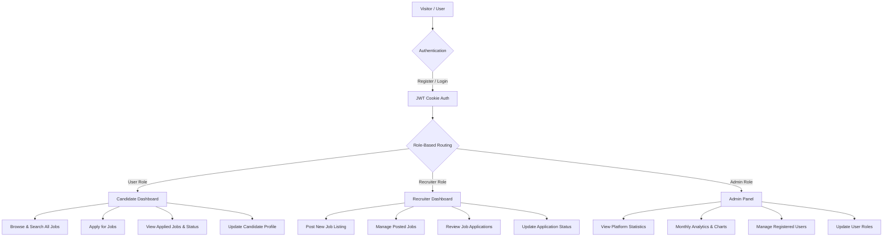

# 🧑‍💼 Full-Stack Job Portal Web Application

A modern, high-performance **Full-Stack Job Portal Web Application** built with Node.js, Express, MongoDB, and React (Vite). Designed for three distinct user roles: **Candidate (Job Seeker)**, **Recruiter (Job Provider)**, and **Admin (Platform Manager)**.

---

## 👔 Leadership Team
- **Vikram K** – Co-Founder & CEO
- **Selvin Jefre B** – Co-Founder & CEO
- **Copyright**: © @2026 Job Portal

---

## 🔑 Example Login Credentials

Use these example credentials to test the different user roles on the platform:

| Role | Email | Password | Access Level |
| :--- | :--- | :--- | :--- |
| **Admin** | `admin@example.com` *(or `admin1@gmail.com`)* | `Admin123#` *(or `Admin1#123456`)* | Full administrative access, user management, and system stats |
| **Recruiter** | `recruiter@example.com` *(or `recruiter1@gmail.com`)* | `Recruiter123#` *(or `Recruiter1#123456`)* | Post new jobs, manage job listings, review & update job applications |
| **User (Candidate)** | `user@example.com` *(or register a new account)* | `User123#` | Browse jobs, apply for positions, view application history |

---

## 🔄 Full Project Architecture & Application Flow



### 1. 🔐 Authentication & Session Flow
- **Registration**: New users register with `username`, `email`, `password`, `gender`, and `location`. The first registered user automatically receives the **Admin** role.
- **Login**: Authenticates email and password via non-blocking asynchronous **Bcrypt (10 salt rounds)**.
- **JWT Session**: Emits a signed JWT stored securely in an `HttpOnly`, `SameSite` cookie for automatic authentication on subsequent requests.

### 2. 👨‍💻 Candidate (Job Seeker) Flow
1. **Browse Jobs**: Search and filter jobs by position, company, location, employment type, or status.
2. **Apply**: Submit job application with resume link directly to recruiters.
3. **Track Applications**: Monitor status updates (*Pending*, *Interview*, *Declined*) in real time.
4. **Manage Profile**: Update personal details, resume links, and location.

### 3. 🧑‍💼 Recruiter (Job Provider) Flow
1. **Post Jobs**: Create job listings with details like position, company, salary, vacancy count, deadline, description, and required skills.
2. **Manage Listings**: Edit or delete active job postings.
3. **Review Applicants**: View candidates who applied for posted jobs.
4. **Update Status**: Change candidate status (*Pending* → *Interview* → *Declined*) with instant persistence.

### 4. 🛡️ Admin Panel Flow
1. **Platform Analytics**: Monitor real-time counts of total users, recruiters, candidates, jobs, and application breakdown.
2. **Monthly Trends**: Interactive Recharts visualization showing job posting frequency over time.
3. **User Control**: View all registered accounts and modify user roles (`user` ↔ `recruiter` ↔ `admin`).

---

## 🛠️ Technology Stack

- **Frontend**:
  - **Framework**: React 18 with Vite
  - **Routing**: React Router DOM (v6) with `React.lazy` Route-level Code Splitting
  - **State & Data Fetching**: `@tanstack/react-query` & Context API (`UserContext`, `JobContext`)
  - **Styling**: Vanilla CSS, Styled-Components, TailwindCSS
  - **UI & Icons**: React-Icons, SweetAlert2, Recharts
- **Backend**:
  - **Runtime**: Node.js & Express.js
  - **Database**: MongoDB Atlas via Mongoose ODM
  - **Security**: JWT (`cookie-parser`), Bcrypt password hashing, CORS credentials
  - **Error Handling**: `http-errors` middleware

---

## ⚡ Performance & Optimization Highlights

1. **Non-blocking Password Hashing**: Async `bcrypt.hash()` with 10 salt rounds to keep the Node.js single-threaded event loop responsive.
2. **Database Query Acceleration**: MongoDB indexes on `JobModel`, `UserModel`, and `ApplicationModel`, combined with `Promise.all()` parallelized query execution.
3. **Prevent Unnecessary Re-renders**: Context values in `UserContext` and `JobContext` are memoized using `useMemo` and `useCallback`.
4. **Route Code Splitting**: Frontend routes dynamically loaded via `React.lazy()` and `<Suspense>`, dramatically reducing initial bundle load times.
5. **Vite Manual Chunking**: Bundles split into dedicated `vendor`, `query`, and `charts` chunks for optimal browser asset caching.

---

## 🔌 Core API Endpoints

| Method | Endpoint | Access | Description |
| :--- | :--- | :--- | :--- |
| `POST` | `/api/v1/auth/register` | Public | Register a new account |
| `POST` | `/api/v1/auth/login` | Public | Authenticate user & issue HTTP-only cookie |
| `GET` | `/api/v1/auth/me` | Authenticated | Get current logged-in user profile |
| `POST` | `/api/v1/auth/logout` | Authenticated | Clear session cookie |
| `GET` | `/api/v1/jobs` | Authenticated | Fetch paginated & filtered jobs list |
| `POST` | `/api/v1/jobs` | Recruiter / Admin | Create a new job listing |
| `PATCH` | `/api/v1/jobs/:id` | Recruiter / Admin | Update an existing job listing |
| `DELETE` | `/api/v1/jobs/:id` | Recruiter / Admin | Delete a job listing |
| `POST` | `/api/v1/application/apply` | User | Submit application for a job |
| `GET` | `/api/v1/application/candidate-applied-jobs` | User | View candidate's submitted applications |
| `GET` | `/api/v1/application/recruiter-posted-jobs` | Recruiter | View applicants for recruiter's jobs |
| `PATCH` | `/api/v1/application/update-status/:id` | Recruiter | Change application status |
| `GET` | `/api/v1/admin/stats` | Admin | Get platform summary statistics |
| `GET` | `/api/v1/admin/monthly-stats` | Admin | Get monthly application trends |
| `PATCH` | `/api/v1/admin/update-role` | Admin | Change role of a registered user |

---

## 🚀 How to Run the Project Locally

### 1. Prerequisites
- Node.js (v16+ recommended)
- MongoDB Atlas cluster URI or local MongoDB database

### 2. Backend Setup
```bash
# Navigate to backend directory
cd full-stack-job-portal-server-main

# Install dependencies
npm install

# Create .env file
# PORT=3000
# DB_STRING=mongodb+srv://<username>:<password>@cluster.mongodb.net/job-portal
# JWT_SECRET=your_jwt_secret_key
# COOKIE_NAME=job_portal_token
# COOKIE_SECRET=your_cookie_secret
# NODE_ENV=development

# Start the server
npm run dev
```

### 3. Frontend Setup
```bash
# Navigate to frontend directory
cd full-stack-job-portal-client-main

# Install dependencies
npm install

# Create .env file (optional, defaults to http://localhost:3000/api/v1)
# VITE_API_URL=http://localhost:3000/api/v1

# Start the development client
npm run dev

# Or build for production
npm run build
```

---

## 📄 License
This project is open source and available under the [MIT License](LICENSE).
